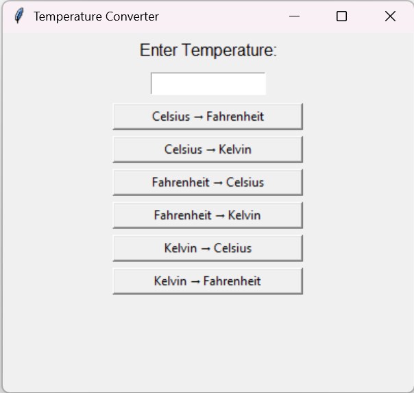

# 🔥 Task 3: Temperature Converter

Welcome to **Task 3** of my **Alfido Tech Internship** journey! 🚀  
In this project, I built a **Temperature Converter** using **Python Tkinter**, which lets users seamlessly convert values between **Celsius, Fahrenheit, and Kelvin** through a clean, interactive GUI. 🌡️✨  

---

## ✨ Highlights
- 🔄 Convert between **3 temperature units** (Celsius, Fahrenheit, Kelvin)  
- 🖥️ **Tkinter-powered GUI** for a smooth user experience  
- 🎯 Accurate, real-time results on a single click  
- ⚡ Lightweight & beginner-friendly Python project  

---

## 🛠️ Tech Stack
- **Python 3** 🐍  
- **Tkinter (GUI library)** 🖼️  

---

## 📌 Features
✅ Celsius → Fahrenheit / Kelvin  
✅ Fahrenheit → Celsius / Kelvin  
✅ Kelvin → Celsius / Fahrenheit  
✅ Centered input field with dedicated conversion buttons  
✅ Bold result display for better readability  

---

## ⚙️ How to Run

Run the Python file

 ```bash
   python temp_converter.py
 ```
---
## 📸 Sneak Peek



---

## 📖 What I Learned

- 🖥️ **Building real-world Python GUI applications**
- 🌡️ **Handling temperature conversion logic efficiently**
- 🎨 **Designing user-friendly interfaces with Tkinter**
- 💡 **Strengthening problem-solving & coding confidence**

---
## 🌟 Internship Journey

This project is part of my Alfido Tech Internship, where I’m exploring Python development through practical, hands-on tasks. Every task adds a new layer to my learning 
journey — from basic calculators ➝ logical apps ➝ now a converter with GUI!
